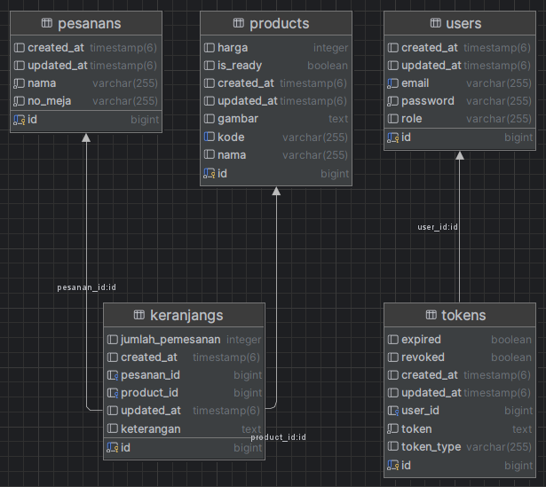

# 🚀 Java Spring Boot & Vue.js 3 (Vite) – Warung Budeeee'Jum Application

Discover how **Java Spring Boot** and **Vue.js 3 + Vite** come together in a fast and interactive full-stack application! 💡

## Example Web Application

<div align="center">

</div>


## Features
✅ **Easily manage Warung Budeeee'Jum**  
✅ **Order your favorite foods** directly from the app  
✅ **Secure authentication & authorization** with Spring Security
---

## Prerequisites

Ensure you have the following installed before running the project:
### Backend
- **Java**: 21
- **Spring Boot**: 3.4.1
- **Spring Security**
- **JWT**
- **Spring Validation**
- **PostgreSQL**
- **Maven**


### Frontend
- **vuejs**: 3.5.13
- **nodejs**: 20.17.0
- **npm**: 8.11.0

---

## Entity Relationship Diagram (ERD)

<div align="center">

</div>

---

## Features

### User Management
- User registration
- User authentication (login)
- Password update
- Token-based refresh authentication
- User logout
- Retrieve user details via headers

### Products Management
- Create product
- Delete Product
- Retrieve specific products by ID
- Retrieve all products

### Keranjangs Management
- Create Keranjang
- Delete Keranjang
- Retrieve all Keranjangs

### Pesanans Management
- Create Pesanan
- Retrieve all Pesanans

### Error Handling
- Comprehensive custom exception handling
- Errors returned in a structured JSON format for better API consumption

---

## Installation

1. Clone the repository:
   ```bash
   git clone https://github.com/budioct/fullstack-warung-budeee-jum.git
   ```

2. Create Postgresql database
   ```bash
   create database db_warung_makan
   ```

3. Navigate to the project directory:
   ```bash
   cd fullstack-warung-budeee-jum
   cd fullstack-warung-budeee-jum/ 
   cd .\fullstack-warung-budeee-jum\
   ```
4. Change postgresql username and password as per your installation
+ open `src/main/resources/application.properties`
+ change `spring.datasource.username` and `spring.datasource.password` as per your mysql installation


5. Build .jar using Maven
   ```bash
   mvn clean compile test package
   ```

6. Build and run spring boot application
   ```bash
   mvn spring-boot:run
   ```

7. The application will run on **http://localhost:8080**


8. Open directory .\frontend\..... install all dependencies
   ```bash
   npm install
   ```
   
9. running application frontend
   ```bash
   npm run dev
   ```

10. The application will run on **http://localhost:5173**


11. For Login **web application!!!!**
   ```
   email   : user@test.com
   password: password
   ```

---

### API Documentation

API documentation is available via Postman. You can access it here:
- Postman Documentation: https://documenter.getpostman.com/view/7284698/2sAYQiBSzB
- Additionally, a Postman collection file inside at directory docs/Documentation Java Spring Boot & Vue.js 3 (Vite).postman_collection.json

---

#### Thank you for exploring this project. Your feedback and contributions are always appreciated.
#### Wishing you success in your development efforts. May this project support and inspire you in building even better solutions.
<br>
Best regards, <br>
Budhi Octaviansyah